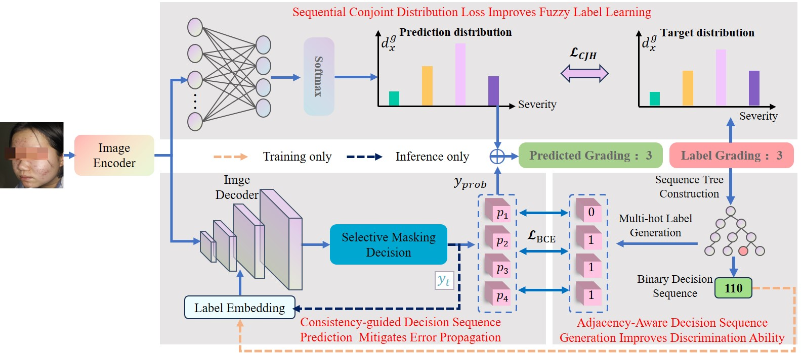

# AFLL
Code for the paper [Adjacency-aware Fuzzy Label Learning for Skin Disease Diagnosis](https://ieeexplore.ieee.org/document/10818707), TFS 2025

<u>[Paper](https://ieeexplore.ieee.org/document/10818707)</u>
# Introduction
Automatic acne severity grading is crucial for the accurate diagnosis and effective treatment of skin diseases. However, the acne severity grading process is often ambiguous due tothe similar appearance of acne with close severity, making it challenging to achieve reliable acne severity grading. Following the idea of fuzzy logic for handling uncertainty in decision-making, we transforms the acne severity grading task into a fuzzy label learning problem, and propose a novel Adjacency-aware Fuzzy Label Learning (AFLL) framework to handle uncertainties in this task. The AFLL framework makes four significant contributions, each demonstrated to be highly effective in extensive experiments. First, we introduce a novel adjacency-aware decision sequence generation method that enhances sequence tree construction by reducing bias and improving discriminative power. Second, we present a consistency-guided decision sequence prediction method that mitigates error propagation in hierarchical decision-making through a novel selective masking decision strategy. Third, our proposed sequential conjoint distribution loss innovatively captures the differences for both high and low fuzzy memberships across the entire fuzzy label set while modeling the internal temporal order among different acne severity labels with a cumulative distribution, leading to substantial improvements in fuzzy label learning. Fourth, to the best of our knowledge, AFLL is the first approach to explicitly address the challenge of distinguishing adjacent categories in acne severity grading tasks. Experimental results on the public ACNE04 dataset demonstrate that AFLL significantly outperforms existing methods, establishing a new state-of-the-art in acne severity grading.



# Using the code
The code is stable while using Python 3.8.13, CUDA >= 11.6

- Clone this repository
```bath
git clone
cd AFLL
```
- To install all the dependencies using conda
```bath
cd env
conda env create -f env.yaml
conda activate AFLL
```
# Links for downloading the public Dataset
1. ACNE04 - <u>[Link (Original)](https://github.com/xpwu95/ldl)</u>

# Using the Code for your dataset
## Dataset Preparation
The dataset consists of three folders: Images, train, and test. The Images folder contains all the images, which are split into training and test sets in an 8:2 ratio. Since this experiment is based on five-fold cross-validation, you need to prepare five different training and test sets in advance. Afterward, update the dataset paths in the code accordingly. If you prefer not to organize the dataset in this format, you can modify the data loader to meet your specific requirements.
```
Images----
    0001.jpg
    0002.jpg
    0003.jpg
    .......
    
train----

    imageName1 label0
    imageName2 label1
    ...
    imageNameN label3
    
test----
    imageName1 label0
    imageName2 label1
    ...
    imageNameM label3
```
## Notes
If you need to adjust the num_classes value in the code and the corresponding binary decision sequence identically according to the kind of classes in the dataset used.

## Acknowledgement
The dataloader code is inspired from <u>[JGC](https://github.com/xpwu95/ldl)</u>.

# Training and Validation
```bath
python main.py
```

# Citation
```
@ARTICLE{10818707,
  author={Zhou, Murong and Zuo, Baifu and Wang, Guohua and Luo, Gongning and Li, Fanding and Dong, Suyu and Wang, Wei and Wang, Kuanquan and Li, Xiangyu and Xu, Lifeng},
  journal={IEEE Transactions on Fuzzy Systems}, 
  title={Adjacency-aware Fuzzy Label Learning for Skin Disease Diagnosis}, 
  year={2024},
  volume={},
  number={},
  pages={1-13},
  keywords={Acne severity grading;Fuzzy Label learning;Fuzzy set theory;Binary search method},
  doi={10.1109/TFUZZ.2024.3524250}}

```
